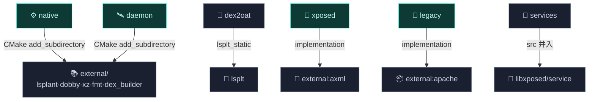

# 📚 external — 第三方依赖

`external` 目录收纳 Vector 通过 git submodule 引入的第三方依赖。它们是 Vector 的技术基石。

> 目录：`external/` · 形式：git submodule

## 它解决什么

Vector 需要一组成熟的第三方 C++/Java 库作为底层能力（ART hook、inline hook、PLT hook、xz 解压、格式化、二进制 manifest 编辑、Java 工具），但不把它们的源码复制进主仓库，而是以 git submodule 形式引用，保留独立上游与版本钉死。

## 模块职责

- **native 依赖宿主**：`external/` 的 CMake 子树被 [native](./native) 与 [daemon](./daemon) 经 `add_subdirectory(${VECTOR_ROOT}/external external)` 引入，构建 `lsplant_static`/`dobby_static`/`xz_static`/`fmt-header-only`/`dex_builder_static` 等静态库。
- **Java 工具库**：`external/axml`（manifest-editor）与 `external/apache`（commons-lang 重命名副本）作为 Gradle `java-library` 模块，被 [xposed](./xposed)/[legacy](./legacy)/[daemon](./daemon) 引用。
- **API 定义来源**：`xposed/libxposed`（libxposed API）与 `services/libxposed`（libxposed service API）是 git submodule，源码直接并入 [xposed](./xposed) 与 [services/daemon-service](./services) 编译。

## 依赖关系

`external` 是依赖树**最底层**，不依赖任何 Vector 模块。所有 native 库经单一 CMake 入口 `external/CMakeLists.txt` 统一构建并 export 静态库 target，供消费者按名引用。

## 主要组成（按构建系统）

| 子模块 | 形式 | 构建产物 | 在 Vector 中的角色 |
| :--- | :--- | :--- | :--- |
| 🧬 [lsplant](https://github.com/JingMatrix/LSPlant) | git submodule | `lsplant_static` | **核心**：改写 `ArtMethod` 入口点 |
| 🪝 [dobby](https://github.com/JingMatrix/Dobby) | git submodule | `dobby_static` | native 模块的 inline hook |
| 📐 [lsplt](https://github.com/JingMatrix/LSPlt) | git submodule | `lsplt_static` | [dex2oat](./dex2oat) hooker 的元数据清洗 |
| 🗜️ [xz-embedded](https://github.com/tukaani-project/xz-embedded) | git submodule | `xz_static` | `ElfImage` 解压 `.gnu_debugdata` |
| 🖨️ [fmt](https://github.com/fmtlib/fmt) | git submodule | `fmt-header-only` | native 层日志格式化 |
| 📝 [axml/manifest-editor](https://github.com/JingMatrix/ManifestEditor) | git submodule | Gradle `external:axml` JAR | 二进制 AndroidManifest 编辑 |
| 📦 [apache/commons-lang](https://github.com/apache/commons-lang) | git submodule | Gradle `external:apache` JAR | Java 工具（重命名副本避免冲突） |
| 🔌 libxposed/api | git submodule（`xposed/libxposed`） | 并入 xposed 编译 | libxposed API 100 定义 |
| 📡 libxposed/service | git submodule（`services/libxposed`） | 并入 daemon-service 编译 | libxposed service API |

> `external/apache` 通过 Gradle 任务把 `ClassUtils`/`SerializationUtils` 复制重命名为 `ClassUtilsX`/`SerializationUtilsX`，避免与宿主应用自带 commons-lang 冲突。

## 构建产物

- **C++ 静态库**：`lsplant_static`、`dobby_static`、`xz_static`、`fmt-header-only`、`dex_builder_static`、`lsplt_static` —— 不单独分发，被静态链接进 `libnative.a`/`libzygisk.so`/`libdaemon.so`/`dex2oat`/`liboat_hook.so`。
- **Java JAR**：`external:axml`、`external:apache` —— 普通 `java-library` 产物，被 Android 模块 `implementation` 引用。
- API submodule 不产出独立产物，源码并入宿主模块编译。

## 与其它模块的交互



- [native](./native) 与 [daemon](./daemon)：CMake 引入整棵 `external/` 子树。
- [dex2oat](./dex2oat)：单独 `add_subdirectory` 引入 `external/lsplt`。
- [xposed](./xposed)：`implementation(projects.external.axml)`；并源集 `libxposed/api`。
- [legacy](./legacy) 与 [daemon](./daemon)：`implementation(projects.external.apache)`。
- [services/daemon-service](./services)：源集并入 `libxposed/interface` + `libxposed/service` 的 AIDL/Java。

## 检出

这些是 git submodule，克隆仓库后需执行：

```bash
git submodule update --init --recursive
```

> ⚠️ 若未检出，构建会失败。CI 中会自动处理。

## 相关

- 各依赖在上游有独立文档，此处仅列其在 Vector 中的角色。
- LSPlant 的 Hook 原理见 [guide · ART Hook 原理](../../guide/art-hook)。
