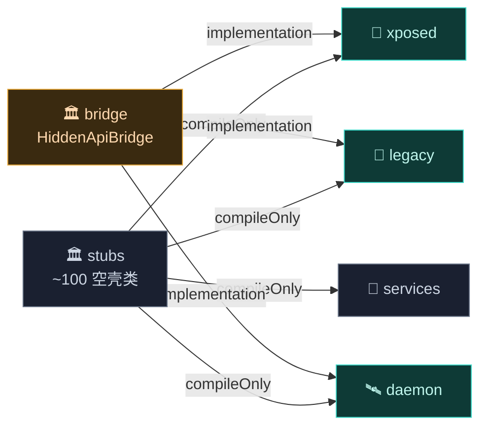
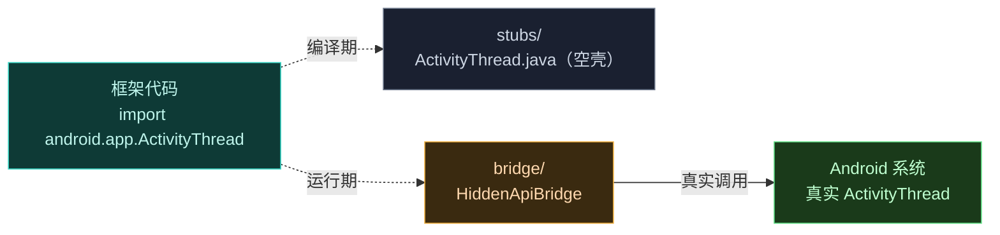

# 🏛️ hiddenapi — 桥与桩

`hiddenapi` 模块让 Vector 能调用 Android 的**非公开（hidden）API**。它分两部分：`bridge`（运行时桥接）和 `stubs`（编译期桩）。

> 目录：[`hiddenapi/`](https://github.com/android-security-engineer/Vector-skills/blob/master/hiddenapi/) · 子模块：`bridge` · `stubs` · 语言：Java

## 它解决什么

Vector 需要大量访问 Android 内部 API（`ActivityThread`、`LoadedApk`、`ResourcesManager`、`BinderInternal` 等），这些 API 在 SDK 里不可见。直接引用会编译失败，运行时反射又繁琐易错。`hiddenapi` 用"编译期桩 + 运行时桥接"解决：

- **stubs**：提供与 Android 内部类**签名一致**的空壳类，让代码能编译通过。
- **bridge**：运行时把桩调用桥接到真实的 Android 内部实现。

## 模块职责

- **编译期可见性**：stubs 提供约 100 个空壳类，镜像 Android 内部签名，使框架代码能直接 `import android.app.ActivityThread` 编译。
- **运行时桥接**：`HiddenApiBridge` 把桩方法调用转发到真实 hidden API，封装反射细节。
- **DEX 内存加载**：`ByteBufferDexClassLoader` 提供 `ByteBuffer` 直接加载 DEX 的隐藏类加载器（框架 DEX 内存加载的基础）。
- **跨模块共享**：作为 `compileOnly`/`implementation` 依赖被几乎所有模块引用，是整个框架的 hidden API 基座。

## 依赖关系

| 子模块 | 依赖 | 形式 |
| :--- | :--- | :--- |
| `stubs` | （无） | 纯 `java-library`，Java 1.8 |
| `bridge` | `stubs` | `compileOnly` |

`stubs` 是依赖树最底层之一（与 [external](./external) 并列），`bridge` 仅依赖 `stubs`。

## 主要组成类

| 类 | 子模块 | 一句话职责 |
| :--- | :--- | :--- |
| `HiddenApiBridge` | bridge | 桥接总入口：把桩方法调用转发到真实 hidden API。 |
| `ByteBufferDexClassLoader` | bridge | 直接从 `ByteBuffer` 加载 DEX 的隐藏类加载器。 |
| `ActivityThread` / `LoadedApk` / `ContextImpl` / `IActivityManager` | stubs | 应用进程内部类签名镜像。 |
| `ServiceManager` / `Binder` / `SystemProperties` / `SELinux` | stubs | 系统层内部类签名镜像。 |
| `ZygoteInit` / `BinderInternal` | stubs | Zygote / Binder 内部签名镜像。 |
| `VMRuntime` / `BaseDexClassLoader` | stubs | 运行时内部签名镜像。 |
| `XResourcesSuperClass` / `XTypedArraySuperClass` | stubs（`xposed.dummy`） | 资源 Hook 动态父类桩。 |

## 构建产物

- **`stubs` JAR** —— 纯 `java-library`（Java 1.8），无 Android 依赖。被其他模块以 `compileOnly` 引用，**不打包进最终产物**（运行时用真实 Android 类）。
- **`bridge` JAR** —— `java-library`，依赖 `stubs`。被模块以 `implementation` 引用，**打包进最终 DEX**，提供运行时桥接逻辑。

## 与其它模块的交互

- 被 [xposed](./xposed)、[legacy](./legacy)、[daemon](./daemon)、[services/daemon-service](./services) 以 `stubs` 为 `compileOnly`、`bridge` 为 `implementation` 引用。
- 是所有 Java/Kotlin 模块的 hidden API 基座：没有 stubs，框架代码无法编译；没有 bridge，桩调用在运行时无真实实现。

## bridge 子模块

| 文件 | 职责 |
| :--- | :--- |
| `HiddenApiBridge.java` | 桥接总入口：把桩方法调用转发到真实 hidden API |
| `ByteBufferDexClassLoader.java` | 直接从 `ByteBuffer` 加载 DEX 的隐藏类加载器 |

## stubs 子模块

约 100 个桩文件，镜像 Android 内部类签名，按包组织：

| 包 | 典型类 | 用途 |
| :--- | :--- | :--- |
| `android.app` | `ActivityThread` · `LoadedApk` · `ContextImpl` · `IActivityManager` | 应用进程内部 |
| `android.content.pm` | `PackageManager` · `IPackageManager` · `PackageInfo` | 包管理 |
| `android.content.res` | `ResourcesImpl` · `AssetManager` · `TypedArray` | 资源 |
| `android.os` | `ServiceManager` · `Binder` · `SystemProperties` · `SELinux` | 系统 |
| `com.android.internal.os` | `ZygoteInit` · `BinderInternal` | Zygote / Binder 内部 |
| `com.android.server.am` | `ActivityManagerService` · `ProcessRecord` | AMS 内部 |
| `dalvik.system` | `VMRuntime` · `BaseDexClassLoader` | 运行时 |
| `xposed.dummy` | `XResourcesSuperClass` · `XTypedArraySuperClass` | 资源 Hook 的动态父类桩 |

## 工作原理

## 子文档

详见 [Hidden API 参考](../hiddenapi/)。
