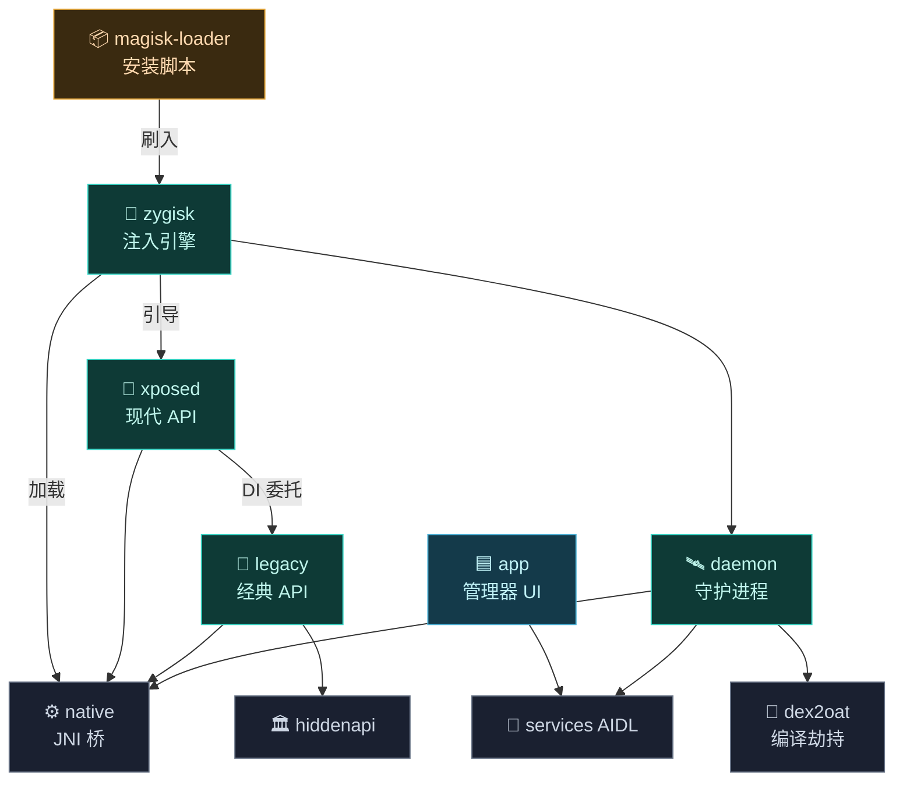
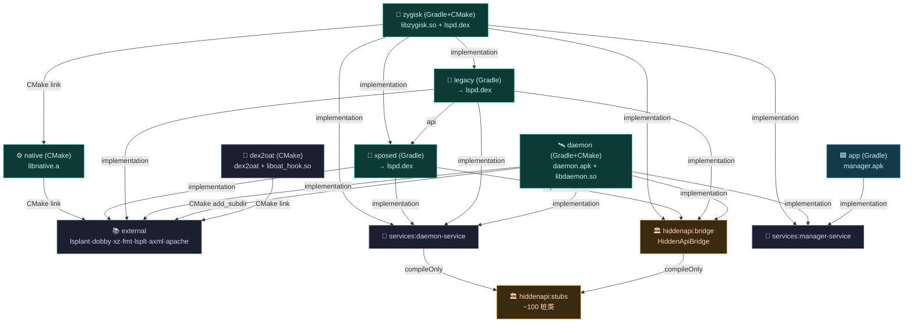

# 🧱 模块总览

Vector 由 11 个 Gradle 模块组成，每个模块边界清晰、职责单一。这一区为每个模块提供独立总览，配合 [类与文件参考](../classes/) 食用。

## 模块速查

| 模块 | 语言 | 职责 | 文档 |
| :--- | :--- | :--- | :--- |
| 🟦 `app` | Java | 寄生式管理器 UI：模块列表、作用域、仓库、日志 | [→](./app) |
| 🛰️ `daemon` | Kotlin / C++ | 沙箱外 root 守护进程：状态、IPC、SELinux、编译劫持 | [→](./daemon) |
| 🧬 `zygisk` | C++ / Kotlin | 注入引擎：Zygote 接管、Binder Trap、内存引导 | [→](./zygisk) |
| ⚙️ `native` | C++ | JNI 桥：ART Hook、ELF 解析、资源改写 | [→](./native) |
| 🔨 `dex2oat` | C++ | AOT 编译器劫持：禁内联、抹痕迹 | [→](./dex2oat) |
| 🔌 `xposed` | Kotlin | 现代 libxposed API 实现：拦截器链 | [→](./xposed) |
| 📜 `legacy` | Java | 经典 `de.robv.android.xposed` 兼容层 | [→](./legacy) |
| 🏛️ `hiddenapi` | Java | 隐藏 API 桥接层 + 编译期桩 | [→](./hiddenapi) |
| 📡 `services` | AIDL | 跨进程服务接口契约 | [→](./services) |
| 📦 `magisk-loader` | Shell | Magisk 模块安装与更新元数据 | [→](./magisk-loader) |
| 📚 `external` | C++ / Java | 第三方依赖子模块 | [→](./external) |

## 依赖关系

## 构建依赖关系图

下图按 Gradle `implementation`/`api` 与 CMake `target_link_libraries`/`add_subdirectory` 的真实构建依赖绘制（箭头 A → B 表示 A 依赖 B）：

> 要点：`external` 与 `hiddenapi:stubs` 是依赖树最底层；`native`（CMake 静态库）只被 `zygisk` 直接链接；`xposed` 与 `legacy` 不含 native 代码，靠 `nativebridge` JNI 经 `libzygisk.so` 落地；`services` 纯接口，实现全在 `daemon`/`app`；`magisk-loader` 不参与构建依赖。

## 阅读建议

- **想理解整体**：从 [zygisk](./zygisk) → [daemon](./daemon) → [native](./native) 顺序读。
- **想写模块**：直奔 [xposed](./xposed) 与 [legacy](./legacy)。
- **想排查问题**：看 [daemon](./daemon) 与 [dex2oat](./dex2oat)。
