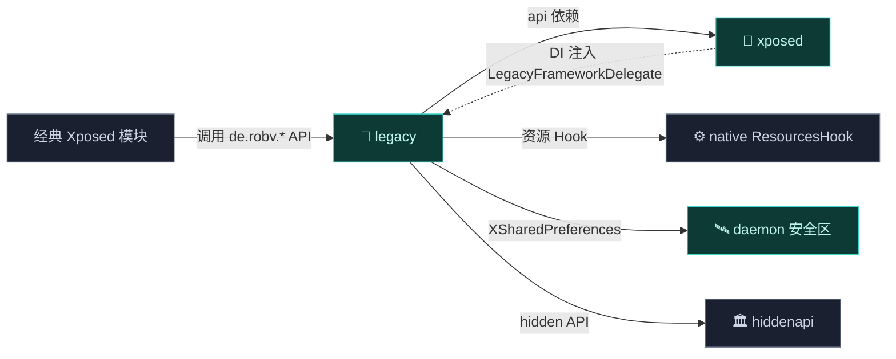

# 📜 legacy — 经典 API 兼容层

`legacy` 子系统实现经典 `de.robv.android.xposed` API 命名空间，同时把执行路由到现代 native ART hook 引擎。它让大量存量 Xposed 模块无需改动即可运行。详见 [架构 · Legacy 兼容层](../../architecture/legacy)。

> 包名空间：`de.robv.android.xposed.*`（公开 API）+ `org.matrix.vector.legacy` / `org.matrix.vector.Startup`（实现）
> 语言：Java

## 模块职责

- **经典 Xposed API 表面**：实现 `de.robv.android.xposed` 命名空间下的全部公开类（`XposedBridge`、`XposedHelpers`、`XC_MethodHook` 等），让存量模块无改动运行。
- **现代↔经典翻译**：把经典 API 的 hook 注册、原方法调用、回调分发路由到 [xposed](./xposed) 的 native ART hook 引擎。
- **资源 Hook**：`XResources` 等拦截二进制资源改写，经 native 层落地。
- **跨进程偏好**：`XSharedPreferences` 经 daemon 预配的安全区直接读文件，无 IPC。
- **DI 桥接**：实现 `LegacyFrameworkDelegate` 契约，由 xposed 在启动期注入。

## 依赖关系

| 依赖 | 形式 | 用途 |
| :--- | :--- | :--- |
| 🔌 [xposed](./xposed) | Gradle `api` | 现代引擎与 DI 契约来源（`api` 使 legacy 的公开类型透传给模块） |
| 📚 [external/apache](./external) | `implementation` | `commons-lang` 工具（`ClassUtilsX`/`SerializationUtilsX` 重命名副本） |
| 🏛️ [hiddenapi/bridge](./hiddenapi) | `implementation` | hidden API 桥接 |
| 📡 [services/daemon-service](./services) | `implementation` | 偏好/作用域等 daemon 服务契约 |
| 🏛️ [hiddenapi/stubs](./hiddenapi) | `compileOnly` | 编译期桩 |

## 主要组成类

| 类 | 一句话职责 |
| :--- | :--- |
| `XposedBridge` | API 中枢：hook 注册/卸载、原方法调用、回调管理。 |
| `XposedHelpers` | 反射工具：`findAndHookMethod`、结构化 `MemberCacheKey` 缓存。 |
| `XposedInit` | 模块加载：解析 `xposed_init`/`native_init`，实例化入口类。 |
| `XSharedPreferences` | 跨进程偏好读取，经 daemon 安全区直接 `FileInputStream`。 |
| `XC_MethodHook` / `XC_MethodReplacement` | before/after 回调基类与完全替换方法基类。 |
| `XResources` / `XModuleResources` / `XResForwarder` | 资源 Hook 表面，重定向到 native `ResourcesHook`。 |
| `SELinuxHelper` | SELinux 访问门面。 |
| `LegacyDelegateImpl` | 现代↔legacy 翻译边界，实现 `LegacyFrameworkDelegate`。 |
| `Startup` | DI 引导：把 `LegacyDelegateImpl` 注入 xposed 的 `VectorBootstrap`。 |

## 构建产物

- **AAR 库**（`com.android.library`，namespace `org.matrix.vector.legacy`），无资源（`androidResources.enable = false`）。
- DEX 经 xposed/zygisk 的 R8 minify 合并进 `framework/lspd.dex`，随 zygisk 模块内存加载。
- 附 `consumer-rules.pro`：模块作为依赖被消费时自动应用 ProGuard 规则保留下表 API。

## 与其它模块的交互

- 依赖 [xposed](./xposed)：`api(projects.xposed)`，但 DI 方向相反——`Startup` 把 `LegacyDelegateImpl` 注入 xposed 的 `VectorBootstrap`。
- 经 [xposed](./xposed) 间接调 [native](./native)：资源 Hook、原方法调用最终落到 native `HookBridge`/`ResourcesHook`。
- 与 [daemon](./daemon)：`XSharedPreferences` 经 daemon 预配的 `xposed_data` 安全区读偏好。
- 与 [hiddenapi](./hiddenapi)：大量引用 `ActivityThread`/`LoadedApk`/`VMRuntime` 等 hidden 类。

## API 表面与边界

| 包 | 职责 |
| :--- | :--- |
| `de.robv.android.xposed` | Java API 表面：`XposedBridge`、`XposedHelpers`、`XC_MethodHook` 等 |
| `de.robv.android.xposed.callbacks` | 回调接口：`XC_LoadPackage`、`XC_InitPackageResources`、`XC_LayoutInflated` 等 |
| `de.robv.android.xposed.services` | 文件访问服务：`BaseService`、`DirectAccessService` |
| `android.content.res` | 资源 Hook：`XResources`、`XModuleResources`、`XResForwarder` |
| `android.app` | `AndroidAppHelper` |
| `org.matrix.vector.legacy` | 状态翻译处理器 `LegacyDelegateImpl` |
| `org.matrix.vector` | `Startup`（DI 引导） |

## 文件清单

| 文件 | 职责 |
| :--- | :--- |
| `XposedBridge.java` | API 中枢：hook 注册、卸载、原方法调用 |
| `XposedHelpers.java` | 反射工具：`findAndHookMethod`、结构化缓存 |
| `XposedInit.java` | 模块加载：解析 `xposed_init`、`native_init` |
| `XSharedPreferences.java` | 跨进程偏好读取 |
| `XC_MethodHook.java` | before/after 回调基类 |
| `XC_MethodReplacement.java` | 完全替换方法 |
| `SELinuxHelper.java` | SELinux 访问门面 |
| `IXposedHookLoadPackage` 等 | 各入口接口 |
| `LegacyDelegateImpl.java` | 现代↔legacy 翻译边界 |
| `Startup.java` | DI 契约建立 |

## 核心机制

- **结构化反射缓存**：`MemberCacheKey` 基于对象身份与结构属性，零分配命中。
- **AOT 反优化**：`VectorDeopter`（在 xposed 模块）配合，把内联方法逐回解释器。
- **before/after 执行序**：前向调用 before，反向调用 after，异常恢复缓存结果。
- **XSharedPreferences**：经 Daemon 预配 `xposed_data` 安全区直接 `FileInputStream`，无 IPC。

## 子文档

各文件详细参考见 [类参考 · legacy](../classes/legacy-api) 起。
