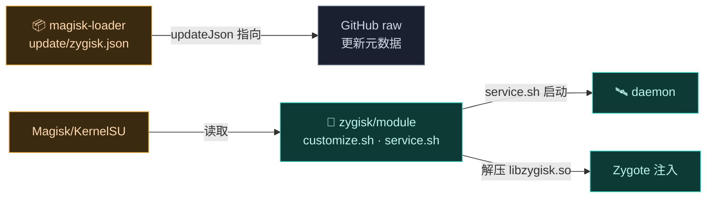
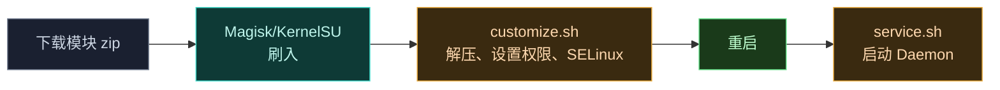

# 📦 magisk-loader — 安装与更新

`magisk-loader` 不是代码模块，而是 Vector 作为 **Magisk/KernelSU 模块**的安装元数据与更新通道。

> 目录：[`magisk-loader/`](https://github.com/android-security-engineer/Vector-skills/blob/master/magisk-loader/) · 内容：Shell 脚本 + JSON + Markdown

## 它解决什么

Vector 以 root 模块 zip 形式分发。这个目录定义模块的安装行为（`customize.sh`、`service.sh` 等）和 OTA 更新元数据，让 Magisk/KernelSU 能正确刷入并在新版本发布时提示更新。

## 模块职责

- **OTA 更新通道**：发布版本号、下载地址、校验值，供 Magisk 管理器轮询新版本。
- **更新日志分发**：随版本附带人类可读变更说明。
- **安装脚本宿主**（脚本本体在 [zygisk 模块](./zygisk) 的 `module/` 目录）：定义刷入时的解压、校验、权限、SELinux、反检测补丁、Daemon 启动等行为。

> ⚠️ 本目录只含**更新元数据**。真正的安装脚本（`customize.sh`/`service.sh`/`sepolicy.rule`/`action.sh`/`uninstall.sh`/`module.prop`）位于 [`zygisk/module/`](./zygisk)，由 zygisk 模块的 `zipAll` 打包任务组装进分发包。

## 依赖关系

`magisk-loader` 不是 Gradle/CMake 模块，无编译依赖。它依赖：

| 依赖 | 形式 | 用途 |
| :--- | :--- | :--- |
| 🧬 [zygisk](./zygisk) 模块脚本 | 文件引用 | 实际安装脚本与 `module.prop` 来源 |
| Magisk / KernelSU / APatch | 运行时 | 提供 `customize.sh` 执行环境、`sepolicy.rule` 加载、`service.sh` late_start 阶段 |

## 主要组成

| 文件 | 作用 |
| :--- | :--- |
| `update/zygisk.json` | 更新通道元数据：`version`、`versionCode`、`zipUrl`、`changelog` |
| `update/changelog.md` | 更新日志（人类可读，随版本发布） |

## 构建产物

- 无编译产物。`update/` 下的两个文件以**静态资源**形式随发布包分发，由 Magisk 管理器在检查更新时拉取 `updateJson` URL（见 `module.prop` 的 `updateJson=` 字段）。

## 与其它模块的交互

- 与 [zygisk](./zygisk)：`module.prop` 的 `updateJson` 字段指向本目录的 `update/zygisk.json`；安装脚本来自 `zygisk/module/`。
- 与 [daemon](./daemon)：`service.sh` 在 Magisk late_start 阶段经 `unshare -m` 启动 daemon 二进制。
- `customize.sh` 还会 patch `daemon.apk` 与 `dex2oat` 二进制中的占位符 hash（`5291374c...` → 随机串）做反检测，触及 [dex2oat](./dex2oat) 产物。

## 安装流程

## 相关

- 安装步骤见 [guide · 安装](../../guide/install)
- 部署文档站本身见 [deployment](../../deployment/)
