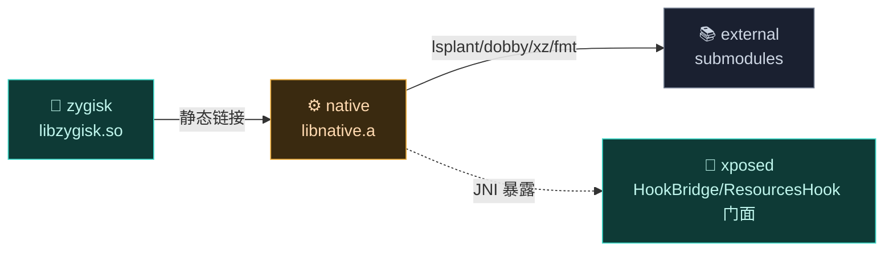
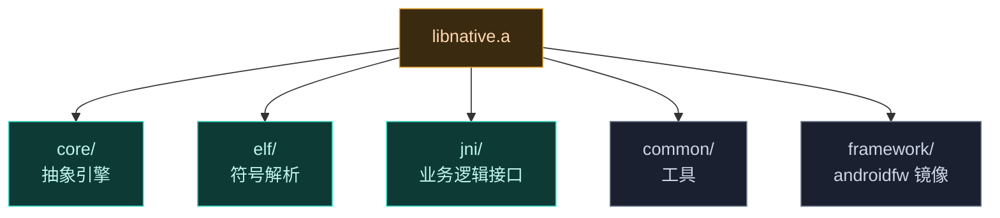

# ⚙️ native — 原生库

`native` 库提供 Android OS 的底层 hook 与修改能力。它不是独立应用，而是一组设计为被更大加载机制（如 Zygisk 模块）集成的**静态库 `libnative.a`**。详见 [架构 · Native 原生库](../../architecture/native)。

> 目录：[`native/`](https://github.com/android-security-engineer/Vector-skills/blob/master/native/) · 语言：C++ · 构建：CMake（静态库）

## 设计哲学

这个库**不假设自己如何被加载**。它定义抽象（如 `Context` 基类），由消费者（Zygisk 模块）提供具体实现。这样核心引擎与具体注入环境解耦。

## 模块职责

- **ART 方法 Hook 引擎**：经 `lsplant` 改写 `ArtMethod` 入口点，提供注册、卸载、原方法调用能力。
- **ELF 符号解析**：在 stripped 的系统二进制里定位内部符号（`art_method`、`entry_point` 等），供 hook 与资源改写使用。
- **资源改写**：运行时拦截二进制 XML（`resources.arsc`/`AndroidManifest`），支持 `XResources` 重定向。
- **native 模块支持**：为第三方 native 模块提供 inline hook 入口（hook `do_dlopen` 调用 `native_init`）。
- **JNI 桥接**：把上述能力以一组 `native` 方法暴露给框架 DEX 的 Kotlin 层调用。

## 依赖关系

`native` 不依赖任何 Gradle 模块，只链接外部 native 库（经 CMake `target_link_libraries`）：

| 依赖 | 形式 | 用途 |
| :--- | :--- | :--- |
| 🧬 `lsplant` | `lsplant_static`（PUBLIC） | ART 方法 Hook 核心引擎 |
| 🪝 `dobby` | `dobby_static`（PUBLIC） | native inline hook |
| 🗜️ `xz-embedded` | `xz_static`（PUBLIC） | 解压 `.gnu_debugdata` 压缩符号表 |
| 🖨️ `fmt` | `fmt-header-only`（PUBLIC） | 现代 C++ 格式化日志 |
| `dex_builder` | `dex_builder_static`（PRIVATE） | 运行时构造 DEX（用于 stub 生成） |
| `log` | 系统（PUBLIC） | Android `__android_log_print` |

PUBLIC 链接会传播给消费者（`zygisk`、`daemon`），因此它们无需重复声明这些依赖。

## 主要组成类

| 类 | 一句话职责 |
| :--- | :--- |
| `Context` | 单例运行时上下文：持有注入 ClassLoader 与入口类，定义 `LoadDex`/`SetupEntryClass` 等供消费者覆写的虚函数。 |
| `ConfigBridge` | native 侧配置缓存单例，存混淆映射等供 JNI 层快速读取。 |
| `ElfImage` | 内存 ELF 解析器：解压 `.gnu_debugdata`、级联（GNU hash → ELF hash → 线性）符号查找。 |
| `ElfSymbolCache` | 线程安全惰性符号缓存，避免重复解析昂贵符号。 |
| `HookBridge` | ART 方法 hook 引擎：维护并发 registry，原子设置备份 trampoline，失败抛 Java 异常而非 native 崩溃。 |
| `ResourcesHook` | 二进制 XML 资源改写，依赖 `framework/` 的结构镜像。 |
| `NativeApiBridge` / `native_api` | 第三方 native 模块注册桥：hook `do_dlopen`，调用模块 `native_init`。 |

## 构建产物

- **`libnative.a`** —— CMake 构建的**静态库**（`add_library(native STATIC ...)`），不单独打包，被静态链接进消费者产物。
- 消费者构建时经 `add_subdirectory(${VECTOR_ROOT}/native native)` 引入，其 `.so`/`.dex`/可执行文件内联含全部 native 代码。

## 与其它模块的交互

- 被 [zygisk](./zygisk) 静态链接：`libzygisk.so` 经 `target_link_libraries(zygisk native)` 内联 native 代码（这是 native 的唯一直接消费者）。
- 通过 JNI 向 [xposed](./xposed) 暴露：`nativebridge` 包下的 `HookBridge`/`NativeAPI`/`ResourcesHook` 是 `native` 侧方法的 Kotlin 门面。
- 与 [daemon](./daemon) 共享技术栈：daemon 的 CMake 同样 `add_subdirectory(${VECTOR_ROOT}/external external)` 引入 `lsplant`/`dex_builder`，但不直接链接 `libnative.a`。
- `dex_builder_static` 同源于 external 的 CMake 树，被 native 与 daemon 共用。

## 模块拆分

## 文件清单

| 文件 | 子模块 | 职责 |
| :--- | :--- | :--- |
| `core/context.cpp` `.h` | core | `Context` 抽象基类：注入生命周期（`LoadDex`/`SetupEntryClass`） |
| `core/config_bridge.cpp` `.h` | core | `ConfigBridge`：native 侧配置缓存单例（混淆映射） |
| `core/native_api.cpp` `.h` | core | native 模块支持：hook `do_dlopen`，调用模块 `native_init` |
| `elf/elf_image.cpp` `.h` | elf | `ElfImage`：解析内存 ELF，解压 `.gnu_debugdata`，级联符号查找 |
| `elf/symbol_cache.cpp` `.h` | elf | `ElfSymbolCache`：线程安全惰性符号缓存 |
| `jni/hook_bridge.cpp` | jni | `HookBridge`：ART 方法 hook 引擎，并发 registry |
| `jni/resources_hook.cpp` | jni | `ResourcesHook`：二进制 XML 资源改写 |
| `jni/native_api_bridge.cpp` | jni | `NativeApiBridge`：native 模块注册的 JNI 桥 |
| `jni/jni_bridge.h` `jni_hooks.h` | jni | JNI 辅助宏与 hook 表 |
| `common/config.h` `logging.h` | common | 常量、fmt 日志 |
| `framework/android_types.h` | framework | 镜像 `libandroidfw.so` 内部结构 |

## 核心能力

- **ART 方法 Hook**：`HookBridge` 维护线程安全 hook 映射，原子设置备份 trampoline，失败时抛 Java 异常而非 native 崩溃。
- **ELF 符号解析**：`ElfImage` 能在 stripped 二进制里解析符号（GNU hash → ELF hash → 线性扫描）。
- **资源改写**：`ResourcesHook` 运行时拦截二进制 XML，依赖 `framework` 的结构镜像。
- **native 模块支持**：`native_api` hook `do_dlopen`，为第三方 native 模块提供 inline hook API。

## 子文档

各文件详细参考见 [类参考 · native](../classes/native-core) 起。
