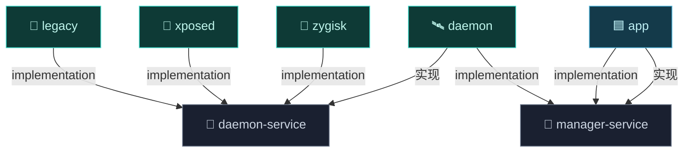
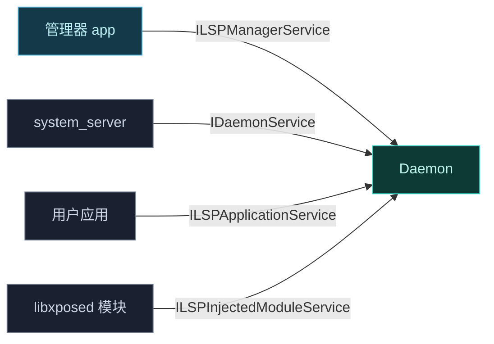

# 📡 services — AIDL 契约

`services` 模块定义 Vector 跨进程通信的 **AIDL 接口契约**。它分三个子模块，纯接口定义，无实现。

> 目录：`services/` · 语言：AIDL + 少量 Java · 子模块：`daemon-service` · `manager-service` · `libxposed`（git 子模块）

## 它解决什么

Vector 的多个进程（Daemon、system_server、用户应用、管理器）需要严格的接口契约来传递 Binder。这些 AIDL 定义了"谁暴露什么、怎么调用"的边界，实现散落在 [daemon](./daemon) 与 [app](./app) 模块。

## 模块职责

- **跨进程契约**：定义 Daemon、system_server、被注入应用、libxposed 模块、管理器之间的 Binder 接口，纯接口无实现。
- **数据模型**：`Module`、`PreLoadedApk`、`Application`、`UserInfo` 等 AIDL Parcelable 定义跨进程数据结构。
- **API 标准来源**：并入 libxposed service API（git 子模块 `services/libxposed`）的 AIDL/Java 源码。
- **共享 Stub**：`Utils.java` 提供被 daemon 与被注入端共用的日志/工具代码。

## 依赖关系

| 子模块 | 依赖 | 形式 |
| :--- | :--- | :--- |
| `daemon-service` | `hiddenapi/stubs`（`compileOnly`）、`androidx.annotation`、libxposed service 源集 | `com.android.library`，AIDL 开启 |
| `manager-service` | `rikkax.parcelablelist` | `com.android.library`，AIDL 开启 |
| `libxposed` | （git 子模块，源码并入 `daemon-service` 编译） | 不独立构建 |

## 主要组成

| AIDL / 文件 | 子模块 | 一句话职责 |
| :--- | :--- | :--- |
| [`IDaemonService`](../aidl/idaemonservice) | daemon-service | 主入口：请求应用服务、分发系统上下文、预启动管理器。 |
| [`ILSPApplicationService`](../aidl/ilspapplicationservice) | daemon-service | 被注入应用拉取框架 DEX、模块列表、混淆映射、偏好。 |
| [`ILSPInjectedModuleService`](../aidl/ilspinjectedmoduleservice) | daemon-service | libxposed 模块进程侧 API：校验、作用域请求、远程偏好。 |
| [`ILSPSystemServerService`](../aidl/ilspsystemserverservice) | daemon-service | system_server 内框架的系统服务上下文、进程注册。 |
| [`IRemotePreferenceCallback`](../aidl/iremotepreferencecallback) | daemon-service | 远程偏好变更回调。 |
| [`ILSPManagerService`](../aidl/ilspmanagerservice) | manager-service | 管理器全部管理操作：启用/禁用、作用域、日志、强停、重启。 |
| `Module.aidl` / `PreLoadedApk.aidl` / `Application.aidl` / `UserInfo.aidl` | models | 跨进程数据模型。 |
| `Utils.java` | daemon-service | daemon 与被注入端共用的日志/工具。 |

## 构建产物

- **`daemon-service` AAR** —— 含编译后的 AIDL Stub 类，namespace `org.lsposed.lspd.daemonservice`。release 不 minify（`isMinifyEnabled = false`）。
- **`manager-service` AAR** —— namespace `org.lsposed.lspd.managerservice`，仅含管理器接口 Stub。
- `aidlPackagedList` 显式打包 `org/lsposed/lspd/models/Module.aidl`，保证消费方能复用该 Parcelable 定义。

## 与其它模块的交互

- [daemon](./daemon)：实现 `daemon-service` 的全部 AIDL 接口（`VectorService`/`ApplicationService`/`ManagerService` 等）+ `manager-service` 的 `ILSPManagerService`。
- [app](./app)：`implementation(projects.services.managerService)`，经 `ILSPManagerService` 调用 daemon 管理功能。
- [zygisk](./zygisk)、[xposed](./xposed)、[legacy](./legacy)：`implementation` 引用 `daemon-service`，作为 Binder 客户端与 daemon 通信。
- libxposed service 子模块源码并入 `daemon-service`，使 libxposed 模块进程的 `ILSPInjectedModuleService` 契约与 daemon 实现对齐。

## 子模块

| 子模块 | 内容 |
| :--- | :--- |
| `daemon-service` | Daemon 对外暴露的服务接口 + 数据模型 |
| `manager-service` | 管理器专用的控制接口 |
| `libxposed` | libxposed service API（git 子模块） |

## daemon-service 接口

| AIDL | 调用方 | 职责 |
| :--- | :--- | :--- |
| [`IDaemonService`](../aidl/idaemonservice) | system_server / 应用 | 主入口：请求应用服务、分发系统上下文、预启动管理器 |
| [`ILSPApplicationService`](../aidl/ilspapplicationservice) | 被注入应用 | 拉取框架 DEX、模块列表、混淆映射、偏好 |
| [`ILSPInjectedModuleService`](../aidl/ilspinjectedmoduleservice) | libxposed 模块进程 | 模块侧 API binder：校验、作用域请求、远程偏好 |
| [`ILSPSystemServerService`](../aidl/ilspsystemserverservice) | system_server 内框架 | 系统服务上下文、进程注册 |
| [`IRemotePreferenceCallback`](../aidl/iremotepreferencecallback) | 偏好监听方 | 远程偏好变更回调 |

数据模型：`Module.aidl`、`PreLoadedApk.aidl`。

## manager-service 接口

| AIDL | 调用方 | 职责 |
| :--- | :--- | :--- |
| [`ILSPManagerService`](../aidl/ilspmanagerservice) | 管理器 app | 启用/禁用模块、作用域、日志、强停、重启等全部管理操作 |

数据模型：`Application.aidl`、`UserInfo.aidl`。

## 通信全景

## 子文档

每个接口的方法级参考见 [AIDL 参考](../aidl/)。
