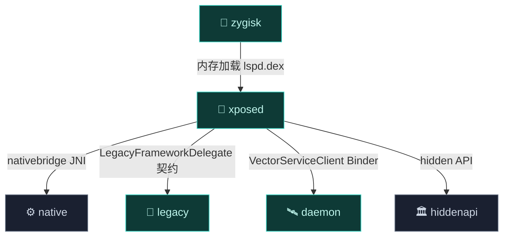

# 🔌 xposed — 现代 API 实现

`xposed` 模块为 Vector 框架实现 [libxposed](https://github.com/libxposed/api) API。它是 native ART hook 引擎（`lsplant`）与模块开发者之间的主桥梁，提供类型安全、OkHttp 风格的拦截器链架构。详见 [架构 · Xposed API 实现](../../architecture/xposed)。

> 包名空间：`org.matrix.vector.impl.*` + `nativebridge` · 语言：Kotlin（完全）

## 架构边界

完全用 Kotlin 编写，独立于 legacy Xposed API 运作。定义 DI 契约 `LegacyFrameworkDelegate`，由 `legacy` 模块在启动时注入。

## 模块职责

- **libxposed API 100 实现**：实现 [libxposed](https://github.com/libxposed/api) 的现代接口（`XposedInterface`/`Hooker`/`Invoker` 等），是模块开发者的主入口。
- **拦截器链**：OkHttp 风格的 `VectorChain`，`proceed()` 递归状态机驱动 before/after/替换语义。
- **生命周期分发**：在各 Android 生命周期点（`attachBaseContext`、`systemServer`、包加载、崩溃）派发给注册的 Hooker。
- **AOT 反优化**：`VectorDeopter` 把被内联的方法逐回解释器，保证 hook 生效。
- **内存 ClassLoading**：模块从 `SharedMemory` 加载，独立 ClassLoader + `jar:` URL 拦截，实现模块隔离。
- **native 门面**：`nativebridge` 包把 [native](./native) 的 ART hook / 资源 hook 能力包装为 Kotlin API。

## 依赖关系

| 依赖 | 形式 | 用途 |
| :--- | :--- | :--- |
| 🏛️ [hiddenapi/bridge](./hiddenapi) | `implementation` | 访问 Android hidden API |
| 📡 [services/daemon-service](./services) | `implementation` | 经 Binder 与 daemon 通信（拉取 DEX/模块列表/混淆映射/偏好） |
| 📚 [external/axml](./external) | `implementation` | 二进制 AndroidManifest 解析（模块元数据读取） |
| 🏛️ [hiddenapi/stubs](./hiddenapi) | `compileOnly` | 编译期桩 |
| `androidx.annotation` | `compileOnly` | 注解 |
| 📜 [legacy](./legacy)（反向） | runtime DI | legacy 实现 `LegacyFrameworkDelegate` 注入回 xposed |

> 注意：`legacy` 在 Gradle 层依赖 `xposed`（`api(projects.xposed)`），DI 契约方向相反——legacy 实现由 xposed 在启动期注入自身。

## 主要组成类

| 类 | 一句话职责 |
| :--- | :--- |
| `VectorBootstrap` | 依赖注入引导，定义 `LegacyFrameworkDelegate` 契约并在启动期注入 legacy 实现。 |
| `VectorNativeHooker` | JNI trampoline 目标，把 hook 调用分发进 `VectorChain`。 |
| `VectorChain` | 拦截器链状态机，`proceed()` 递归驱动 before/after/替换。 |
| `BaseInvoker` / `VectorCtorInvoker` | 调用系统：绕过访问检查执行原方法、按优先级执行部分链、构造函数分离分配与初始化。 |
| `VectorDeopter` | AOT 反优化：把内联方法逐回解释器。 |
| `VectorModuleClassLoader` | 模块独占 ClassLoader，挂框架私有分支。 |
| `VectorModuleManager` | 模块加载、卸载、作用域管理。 |
| `HookBridge` / `NativeAPI` / `ResourcesHook` | `nativebridge`：[native](./native) 层能力的 Kotlin 门面。 |

## 构建产物

- **AAR 库**（`com.android.library`，namespace `org.matrix.vector.impl`），最终 DEX 被打包进 zygisk 模块的 `framework/lspd.dex`（经 R8 minify）。
- 源集合并了 git 子模块 `libxposed/api/src/main/java`，即 libxposed API 定义本身随本模块一起编译。
- `androidResources.enable = false`：无资源，纯代码库。

## 与其它模块的交互

- 被 [zygisk](./zygisk) 加载：zygisk 的 Kotlin 入口 `Main.forkCommon` 调 `Startup.initXposed` / `Startup.bootstrapXposed`，后者位于本模块。
- 与 [legacy](./legacy)：定义 `LegacyFrameworkDelegate`，legacy 实现 `LegacyDelegateImpl` 并在 `Startup` 注入；经典 API 的 hook 注册最终路由到本模块的 native 引擎。
- 与 [native](./native)：`nativebridge` 包的 `native` 方法对应 `HookBridge`/`ResourcesHook` 的 JNI 实现。
- 与 [daemon](./daemon)：`VectorServiceClient` 经 `ILSPApplicationService` 拉取框架 DEX、模块列表、混淆映射、远程偏好。
- 与 [hiddenapi](./hiddenapi)：大量引用 `ActivityThread`/`LoadedApk` 等 hidden 类。

## 文件清单

| 包 | 文件 | 职责 |
| :--- | :--- | :--- |
| `impl` | `VectorContext.kt` · `VectorLifecycleManager.kt` · `VectorRemotePreferences.kt` | 上下文、生命周期分发、远程偏好 |
| `impl/core` | `VectorDeopter` · `VectorInlinedCallers` · `VectorModuleManager` · `VectorServiceClient` · `VectorStartup` | 反优化、内联调用 registry、模块管理、Daemon 客户端、启动 |
| `impl/di` | `VectorBootstrap` | 依赖注入引导 |
| `impl/hookers` | `AppAttachHooker` · `CrashDumpHooker` · `DexTrustHooker` · `LoadedApkHookers` · `SystemServerHookers` | 各生命周期 Hook 点 |
| `impl/hooks` | `BaseInvoker` · `VectorChain` · `VectorLegacyCallback` · `VectorNativeHooker` | 拦截器链、JNI trampoline、调用系统 |
| `impl/utils` | `VectorMetaDataReader` · `VectorModuleClassLoader` · `VectorURLStreamHandler` | 模块元数据、隔离 ClassLoader、jar: 拦截 |
| `nativebridge` | `HookBridge` · `NativeAPI` · `ResourcesHook` | native 层的 Kotlin 门面 |

## 核心组件

### Hook 引擎

`VectorHookBuilder`（注册）→ `VectorNativeHooker`（JNI trampoline 目标）→ `VectorChain`（递归 `proceed()` 状态机）。详见 [架构 · Hook 引擎](../../architecture/xposed#1-hook-引擎)。

### 调用系统

`Invoker` 让模块执行方法时绕过 JVM 访问检查：`Type.Origin`（绕过所有 hook）、`Type.Chain`（按 `maxPriority` 执行部分链）、`VectorCtorInvoker`（构造函数分离分配与初始化）。

### 内存 ClassLoading

模块从 `SharedMemory` 加载，`VectorModuleClassLoader` 独占挂在框架私有分支，`VectorURLStreamHandler` 拦截 `jar:` 请求。详见 [架构 · 内存 ClassLoading](../../architecture/xposed#4-内存-classloading-与隔离)。

## 子文档

各文件详细参考见 [类参考 · xposed](../classes/xposed-core) 起。
