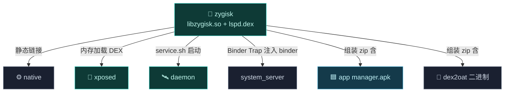
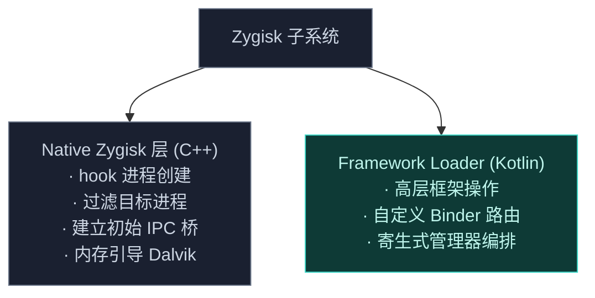

# 🧬 zygisk — 注入引擎

`zygisk` 是 Vector 的**注入引擎**——它衔接 Android Zygote 进程与高层 Java/Kotlin Xposed API。它避免标准 Android 服务注册和磁盘类加载，全程通过内存执行、JNI 级 Binder 拦截、进程身份移植运作。详见 [架构 · Zygisk 模块](../../architecture/zygisk)。

> 包名空间：`org.matrix.vector.*`（Kotlin）+ `cpp/`（Native Zygisk 层）

## 模块职责

- **Zygote 接管**：实现 `ZygiskModule` 接口，在 `specialize` 回调里过滤目标进程并注入框架。
- **Binder Trap（IPC）**：hook 系统 `Binder.execTransact`，用 `_VEC` 码建立 native↔Kotlin 的初始通信桥，无需注册标准服务。
- **内存引导**：从 `SharedMemory`/内存映射加载框架 DEX（`lspd.dex`），不落地磁盘类加载。
- **寄生式管理器**：把管理器 APK 注入宿主进程运行，移植进程身份，无独立包名。
- **Daemon 编排**：经 `service.sh` 启动 [daemon](./daemon)，并把 daemon 的 binder 注入 system_server。
- **打包分发**：`zipAll` 任务组装整个 Magisk/KernelSU 模块 zip（含 manager.apk、daemon.apk、libzygisk.so、dex2oat 二进制、lspd.dex、安装脚本）。

## 依赖关系

| 依赖 | 形式 | 用途 |
| :--- | :--- | :--- |
| ⚙️ [native](./native) | CMake `target_link_libraries(zygisk native)` | 静态链接 ART hook/ELF 解析/JNI 桥 |
| 🔌 [xposed](./xposed) | Gradle `implementation` | 内存加载的框架 DEX 即 xposed 模块产物 |
| 📜 [legacy](./legacy) | Gradle `implementation` | 经 xposed 传递依赖，DI 注入 |
| 📡 [services/manager-service](./services) | Gradle `implementation` | 管理器控制接口契约 |
| 📡 [services/daemon-service](./services) | Gradle `implementation` | 应用/系统服务接口契约 |
| 🏛️ [hiddenapi/bridge](./hiddenapi) | Gradle `implementation` | hidden API 桥接 |
| 🏛️ [hiddenapi/stubs](./hiddenapi) | `compileOnly` | 编译期桩 |
| 📦 [magisk-loader](./magisk-loader) | 运行时引用 | `updateJson` 指向更新元数据 |

## 主要组成类

| 类/文件 | 一句话职责 |
| :--- | :--- |
| `cpp/module.cpp` | Zygisk 模块入口，实现 `ZygiskModule`，处理 `preAppSpecialize`/`preServerSpecialize` 回调。 |
| `cpp/ipc_bridge.cpp` / `.h` | JNI Binder Trap：`SetTableOverride` 替换 `CallBooleanMethodV`，拦截 `execTransact` 识别 `_VEC` 码。 |
| `core/Main.kt` | Kotlin 框架入口 `forkCommon`，从内存加载 DEX 并启动 xposed/legacy 引导。 |
| `ParasiticManagerHooker.kt` | 寄生管理器：宿主进程身份移植，让管理器在宿主进程内运行。 |
| `ParasiticManagerSystemHooker.kt` | system_server 内 Intent 重定向，拉起寄生管理器。 |
| `service/BridgeService.kt` | Binder Trap 的 Kotlin 侧：分发 `_VEC` 事务（如接收 daemon 注入的 binder）。 |
| `service/ParcelUtils.kt` | Binder parcel 序列化辅助。 |
| `module/customize.sh` / `service.sh` | 安装脚本与 daemon 启动脚本（见 [magisk-loader](./magisk-loader)）。 |

## 构建产物

- **`libzygisk.so`** —— 共享库（CMake `add_library(zygisk SHARED ...)`），作为 Zygisk 模块二进制，按 ABI 分 32/64 位放入模块 zip 的 `lib/<abi>/`，安装后重命名为 `<abi>.so`。
- **`framework/lspd.dex`** —— 本模块 Kotlin 编译产物（含 xposed/legacy）经 R8 minify 后的单 DEX，安装后内存加载。
- **Magisk 模块 zip** —— `zipAll` 任务产出 `Vector-v<ver>-<code>-<variant>.zip`，含 manager.apk、daemon.apk、libzygisk.so、dex2oat 二进制、lspd.dex、脚本、module.prop，并附每个文件的 `.sha256`。
- 同时注册 `installMagisk`/`installKsu`/`installApatch` 系列 adb 安装任务。

## 与其它模块的交互

- 静态链接 [native](./native)：`libzygisk.so` 内联全部 native 代码。
- 内存加载 [xposed](./xposed)：`lspd.dex` 即 xposed（+legacy）的 minify 产物。
- 启动 [daemon](./daemon)：`service.sh` 经 `unshare -m` 后台启动 daemon，daemon 再把 `VectorService` binder 经 Binder Trap 注入回 system_server。
- 打包 [app](./app) 的 `manager.apk`、[daemon](./daemon) 的 `daemon.apk`、[dex2oat](./dex2oat) 的二进制进分发 zip。
- 经 [magisk-loader](./magisk-loader) 的 `update/zygisk.json` 提供 OTA 更新。

## 两层结构

## 文件清单

| 文件 | 层 | 职责 |
| :--- | :--- | :--- |
| `cpp/module.cpp` | Native | Zygisk 模块入口，实现 `ZygiskModule` 接口，处理 specialize 回调 |
| `cpp/ipc_bridge.cpp` / `.h` | Native | JNI Binder Trap：hook `execTransact`，识别 `_VEC` 码 |
| `kotlin/.../core/Main.kt` | Kotlin | 框架引导入口 `forkCommon`，从内存加载框架 DEX |
| `kotlin/.../ParasiticManagerHooker.kt` | Kotlin | 寄生管理器：宿主进程身份移植 |
| `kotlin/.../ParasiticManagerSystemHooker.kt` | Kotlin | system_server 内 Intent 重定向，启动寄生管理器 |
| `kotlin/.../service/BridgeService.kt` | Kotlin | Binder Trap 的 Kotlin 侧：处理 `_VEC` 事务分发 |
| `kotlin/.../service/ParcelUtils.kt` | Kotlin | Binder parcel 序列化辅助 |

## 核心机制

### JNI Binder Trap

`ipc_bridge.cpp` 用 ART 内部函数 `SetTableOverride` 替换 `CallBooleanMethodV`，拦截系统范围所有 `Binder.execTransact` 调用。匹配 `_VEC` 码的转给 `BridgeService`，其余原样放行。详见 [架构 · IPC](../../architecture/ipc#jni-binder-trap)。

### 寄生式管理器

`ParasiticManagerHooker` / `ParasiticManagerSystemHooker` 让管理器 APK 注入宿主进程运行，无独立包名。详见 [架构 · 寄生机制](../../architecture/zygisk#寄生式管理器与身份移植)。

## 子文档

cpp 与 kotlin 各文件详细参考见 [类参考 · zygisk](../classes/zygisk-cpp) 起。
